# Pitch Gym

> An AI-powered voice platform where startup founders practice investor pitches against a realistic AI investor and get structured, scored feedback in real time.

Pitch Gym lets founders rehearse **10 distinct pitch scenarios** — from elevator pitches to VC-ready presentations and Demo Day simulations — through real-time voice conversations with an AI investor named **Alex**. Each session produces a multi-metric assessment with quantitative scores, qualitative analysis, identified strengths and weaknesses, and actionable improvement suggestions.

The platform addresses a real gap in entrepreneurship education: high-quality pitch coaching is expensive (\$200–500 per session with human coaches), geographically concentrated, and time-bound. Pitch Gym makes structured pitch training available on demand to any founder with a browser and a microphone.

---

## Key Features

- **Real-time voice AI conversations** powered by the Vapi Web SDK over WebRTC, with sub-second latency
- **10 specialized pitch types** — each with its own AI investor persona, system prompt, and assessment schema (see [Pitch Types](#pitch-types) below)
- **Structured multi-metric assessment** — per-category 1–5 scoring, strengths, weaknesses, biggest concern, improvement suggestions
- **Idea Bank** — manage multiple startup ideas and group sessions by venture
- **Session context carry-forward** — the AI investor references previous sessions for continuity and progressive coaching
- **Analytics dashboard** — score trends over time, skill radar charts, pitch type distribution, idea-level filtering
- **Time-based credit system** — 1 credit = 1 minute with fractional precision, server-side enforcement via Vapi's `maxDurationSeconds`
- **Razorpay integration** — dual-verification payment flow with HMAC-SHA256 signature validation and idempotent credit handling
- **LLM JSON repair pipeline** — graceful recovery from malformed structured output (96% effective success rate)

---

## Pitch Types

Each pitch type runs against a dedicated Vapi assistant with a tailored system prompt and assessment schema. The metrics listed below are the per-category dimensions scored on a 1–5 scale.

| # | Pitch Type | Why It Exists | Assessment Metrics | Duration |
|---|---|---|---|---|
| 1 | **Idea Validation** | Test if your problem is real and worth solving before building anything. | Problem Clarity, Customer Definition, Evidence, Communication | Untimed |
| 2 | **Elevator Pitch** | Deliver a crisp, compelling 60-second pitch that sticks. | Clarity, Memorability, Market Framing, Confidence | 3 min cap |
| 3 | **VC Ready** | Full investor-style session covering all pillars of a fundable startup. | Business Model, Traction, Go-to-Market, Pressure Handling | Untimed |
| 4 | **Product Feedback** | Get sharp product critique from an investor's lens. | Product Clarity, Differentiation, UX Quality, Value Prop | Untimed |
| 5 | **Customer Discovery** | Prove you deeply understand who you're building for and why. | Customer Behavior, Problem Context, Insights, Alternatives | Untimed |
| 6 | **Technical Pitch** | Defend your architecture and technical decisions to a technical investor. | Architecture, Feasibility, Scalability, Technical Moat | Untimed |
| 7 | **Demo Day** | Simulate a high-stakes Demo Day presentation under the spotlight. | Storytelling, Market Opportunity, Traction, Stage Presence | 10 min cap |
| 8 | **Customer Pitch** | Pitch directly to a potential customer and win their buy-in. | Problem Relevance, Value Prop, Workflow Fit, Cost Justification | Untimed |
| 9 | **Co-Founder Pitch** | Convince a potential co-founder to join your vision. | Vision Clarity, Role Alignment, Commitment, Persuasion | Untimed |
| 10 | **Investor Skeptic Mode** | Face an aggressive skeptic who challenges every assumption. | Pressure Handling, Competition Defense, Composure, Realism | Untimed |

"Untimed" pitches are bounded only by available credits.

---

## Tech Stack

| Layer | Technology |
|---|---|
| Frontend | React 19, Vite 7, Tailwind CSS v4, shadcn/ui |
| Routing | react-router-dom v7 (`createBrowserRouter`) |
| Charts | Recharts |
| Voice AI | Vapi Web SDK 2.5, WebRTC |
| Backend | Supabase (PostgreSQL, Auth, Edge Functions, Storage, RLS) |
| Edge Runtime | Deno (TypeScript) |
| Payments | Razorpay (with HMAC-SHA256 verification) |
| Testing | Vitest |

---

## Architecture

Pitch Gym uses a **three-tier serverless architecture** with a React SPA client, Supabase Edge Functions for the trusted server-side API layer, and managed PostgreSQL with Row-Level Security.

<p align="center">
  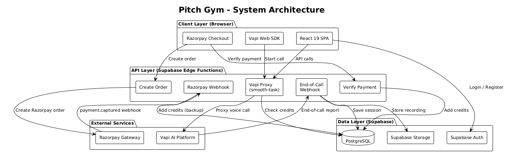
</p>

### Use Cases

<p align="center">
  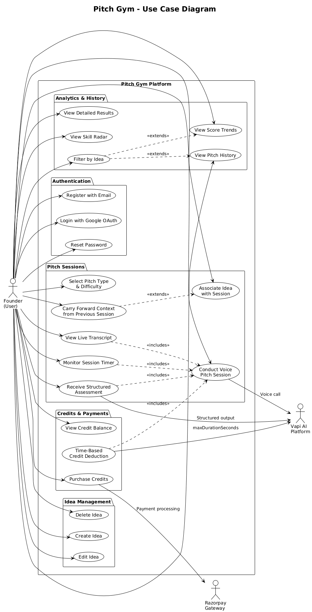
</p>

### Entity Relationship Diagram

<p align="center">
  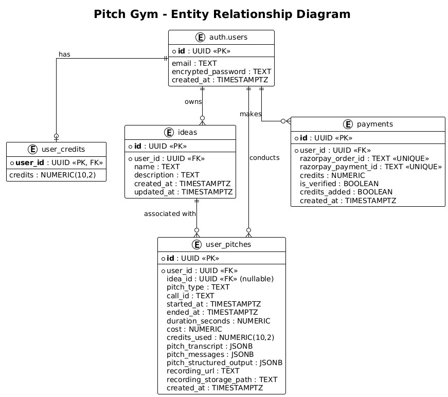
</p>

### Edge Functions

| Function | Method | Purpose |
|---|---|---|
| `smooth-task` | POST | Vapi proxy — authenticates user via JWT, checks credit balance, selects assistant by pitch type, configures `maxDurationSeconds` and context overrides |
| `end-of-call-webhook` | POST | Processes Vapi end-of-call reports — fetches full call data with retries, stores recording, saves structured assessment, deducts time-based credits |
| `create-order` | POST | Creates Razorpay payment orders with server-side price-to-credit mapping |
| `verify-payment` | POST | Verifies Razorpay payment signature (HMAC-SHA256) and adds credits idempotently |
| `razorpay-webhook` | POST | Backup webhook verification for `payment.captured` events |

### Database Schema

| Table | Description |
|---|---|
| `user_credits` | Per-user credit balance as `numeric(10,2)` for fractional minute support |
| `user_pitches` | Pitch sessions with call metadata, transcript, structured output, recording path, duration, credits used, idea association |
| `ideas` | User-created startup ideas with name, description, timestamps |
| `payments` | Razorpay payment records with order ID, payment ID, verification status, idempotent credit tracking |

---

## Getting Started

### Prerequisites

- Node.js 20+
- A [Supabase](https://supabase.com) project
- A [Vapi AI](https://vapi.ai) account with assistants configured for each pitch type
- A [Razorpay](https://razorpay.com) account (test mode works for development)

### Installation

```bash
git clone <your-repo-url>
cd vapi_shark
npm install
```

### Environment Variables

Create a `.env` file at the project root:

```env
VITE_SUPABASE_URL=your-supabase-project-url
VITE_SUPABASE_ANON_KEY=your-supabase-anon-key
VITE_VAPI_PUBLIC_KEY=your-vapi-public-key
VITE_RAZORPAY_KEY_ID=your-razorpay-key-id
```

Server-side secrets must be configured in the Supabase dashboard:

```
VAPI_API_KEY
RAZORPAY_KEY_SECRET
RAZORPAY_WEBHOOK_SECRET
```

### Development

```bash
npm run dev      # Start Vite dev server on http://localhost:5173
npm run build    # Production build
npm run preview  # Preview production build
npm run lint     # Run ESLint
```

---

## Project Structure

```
src/
├── components/
│   ├── ui/                  # shadcn/ui primitives
│   └── layout/              # Layout components (navbar, etc.)
├── context/
│   └── authcontext.jsx      # Auth provider with Supabase session
├── db/
│   ├── supabase.js          # Supabase client
│   └── auth.js              # Auth API helpers
├── hooks/                   # Custom React hooks
├── lib/
│   ├── pitchParser.js       # LLM output parsing & JSON repair
│   ├── pitchAnalytics.js    # Score extraction & aggregation
│   ├── pitchContext.js      # Context carry-forward summary builder
│   └── founderAnalytics.js  # Dashboard analytics computation
└── pages/
    ├── LandingPage.jsx
    ├── Auth.jsx
    ├── Dashboard.jsx
    ├── PitchDashboard.jsx   # Three-step pitch session flow
    ├── PitchHistory.jsx
    ├── PitchResult.jsx
    ├── FounderAnalytics.jsx
    ├── IdeaBank.jsx
    └── Pricing.jsx
```

---

## How It Works

1. **Configure the session** — pick one of 10 pitch types, optionally tag it to an idea, optionally carry forward context from a previous session.
2. **Voice conversation** — the Vapi Web SDK opens a WebRTC stream to the `smooth-task` edge function, which authenticates the user, validates credits, and configures the right Vapi assistant with the appropriate duration cap.
3. **Live transcript** — partial and final transcript segments stream into the UI in real time. A countdown timer fires warnings at 2 minutes and 1 minute remaining, and auto-ends the call at zero.
4. **End of call** — Vapi sends a webhook to `end-of-call-webhook`, which fetches the full call data (with retries while structured output is generating), saves the recording to Supabase Storage, parses the structured LLM output (with JSON repair), and deducts fractional credits via an atomic RPC call.
5. **Structured feedback** — the result page displays per-metric scores, qualitative analysis, identified strengths and weaknesses, biggest concern, and actionable improvement suggestions.
6. **Track progress** — the analytics dashboard surfaces score trends, skill radar charts, and pitch-type distribution; idea-level filtering shows how each venture is progressing over time.

### Pitch Session Sequence

<p align="center">
  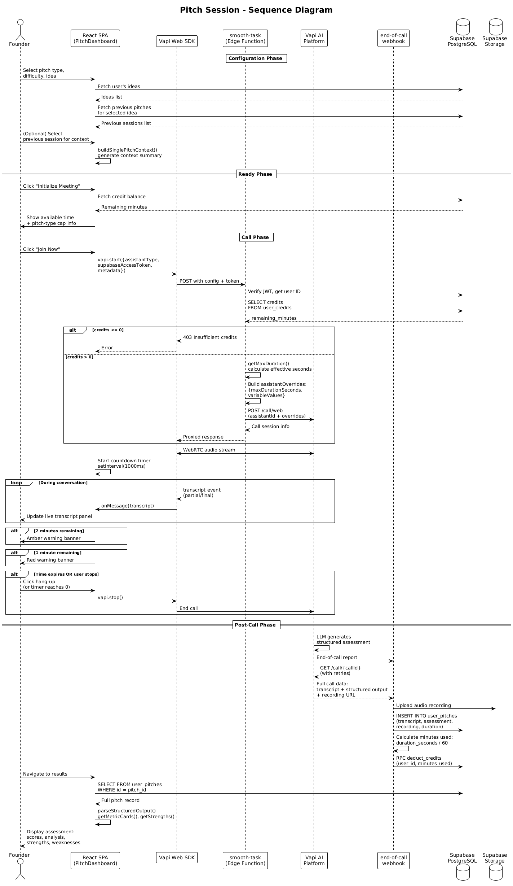
</p>

### User Flow

<p align="center">
  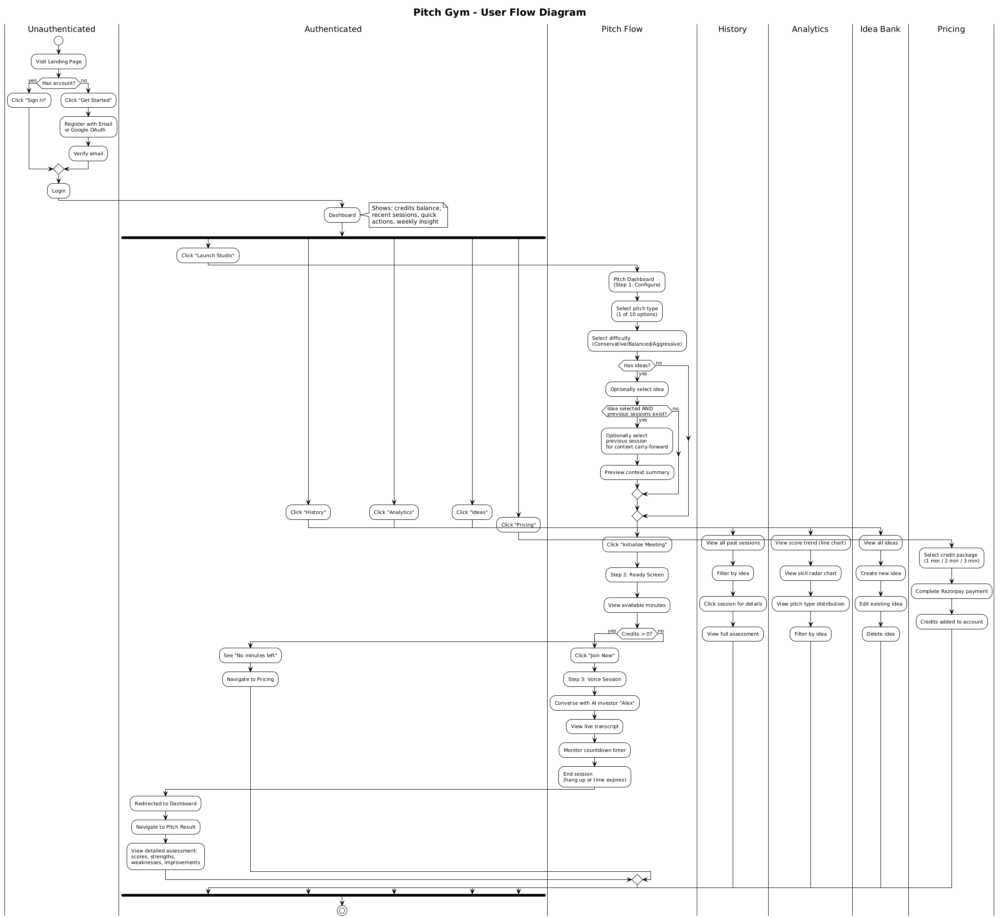
</p>

### PitchDashboard State Machine

<p align="center">
  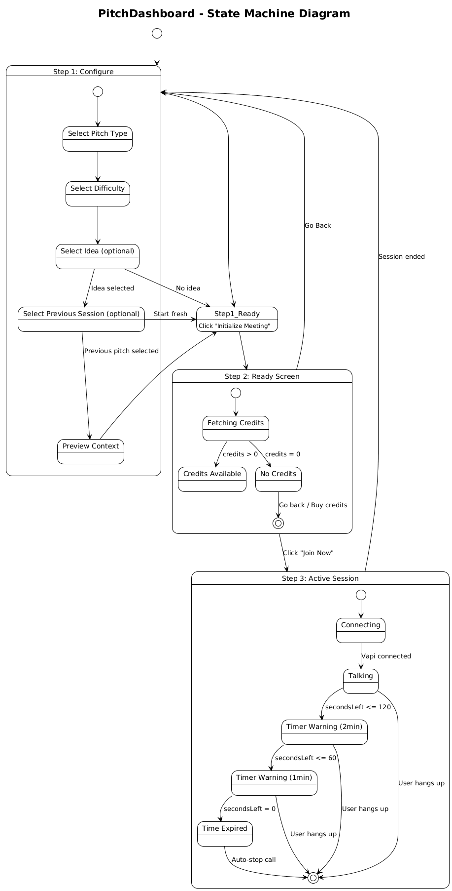
</p>

---

## Screenshots

### Pitch Selection
<p align="center">
  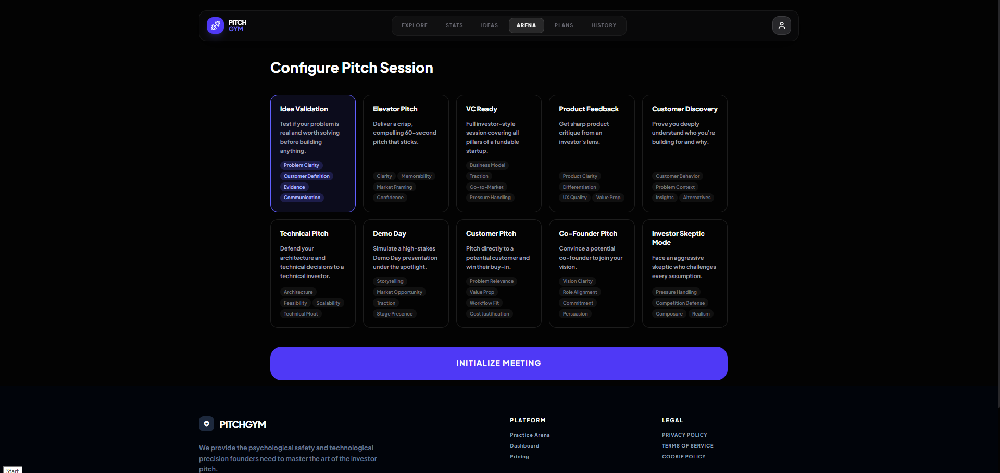
</p>

### Active Pitch Session
<p align="center">
  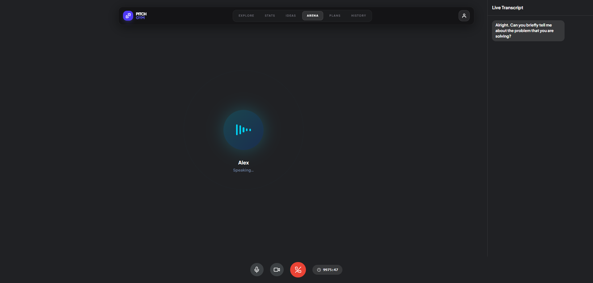
</p>

### Structured Feedback
<p align="center">
  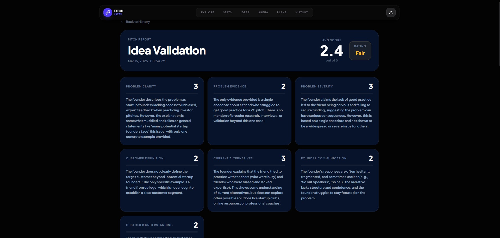
</p>

### Founder Analytics
<p align="center">
  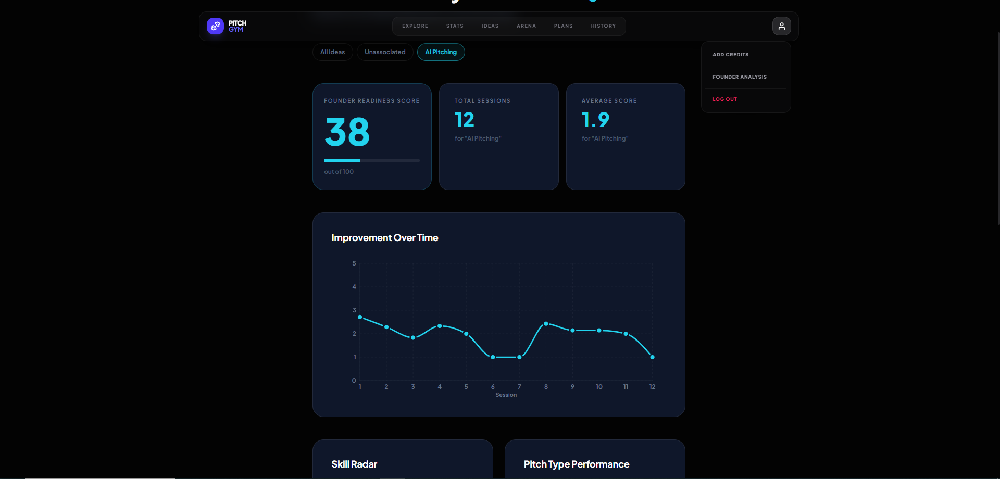
</p>

---

## Security

- **Row-Level Security (RLS)** — all user data is isolated through Supabase RLS policies; users can only access their own data
- **Server-side credit enforcement** — credits are validated and deducted server-side; clients cannot bypass duration limits
- **Cryptographic payment verification** — Razorpay payments are verified with HMAC-SHA256 signatures using the Web Crypto API
- **Idempotent credit operations** — duplicate webhook deliveries never double-credit (tracked via the `payments` table)
- **JWT-based authentication** — Supabase Auth with automatic token refresh and `onAuthStateChange` subscriptions

### Authentication Flow

<p align="center">
  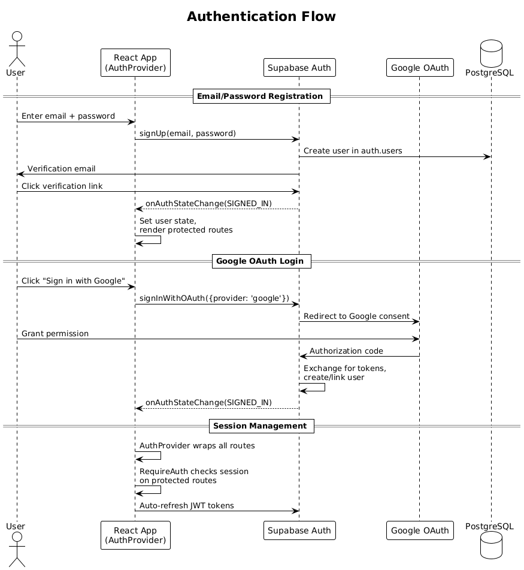
</p>

### Payment Processing (Dual Verification)

<p align="center">
  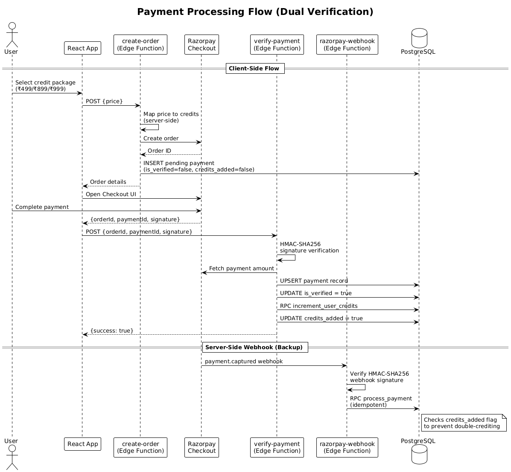
</p>

---

## Testing

```bash
npx vitest        # Run all unit tests
```

The Vitest suite covers the three core utility modules:

- `pitchParser.js` — structured output parsing, JSON repair, assessment key detection, metric/rating/strength/weakness extraction
- `pitchAnalytics.js` — score aggregation, rating color mapping, assessment object extraction
- `pitchContext.js` — context carry-forward string generation, character limits, fallback handling

---

## Implementation Highlights

### LLM JSON Repair

The Vapi assistants are configured with structured output schemas, but LLMs occasionally produce malformed JSON (smart quotes, trailing commas, unescaped characters). The `pitchParser.js` module repairs common issues automatically:

```javascript
// Smart quote replacement, trailing comma removal, graceful fallback
let repaired = value
  .replace(/[“”]/g, '"')
  .replace(/,\s*}/g, '}')
  .replace(/,\s*]/g, ']');
```

This raises the effective success rate from 82% (raw) to 96% (after repair).

### Server-side Duration Enforcement

The Vapi proxy computes the maximum call duration as the minimum of remaining credits and the pitch-type cap (e.g., 3 minutes for Elevator Pitch, 10 minutes for Demo Day), then passes it as `maxDurationSeconds` to Vapi. This means even a tampered client cannot exceed the user's available time.

### Idempotent Payment Processing

Razorpay payments are verified via two independent paths — a client-side signature check after checkout, and a server-side webhook for `payment.captured` events. Both paths call the same `process_payment` RPC, which tracks `credits_added` status per payment to prevent double-crediting.

---

## License

MIT
